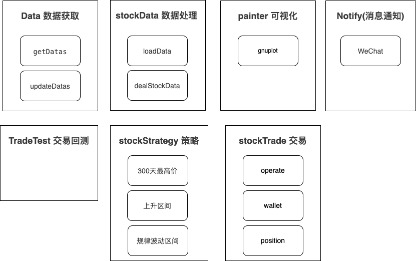

# Stock-go 概要设计文档

## 1. 简介

### 1.1 背景介绍


### 1.2 名词解释

#### 名词释义

| 术语 | 定义 | 说明 |
|------|------|------|
| **票票会话(Session)** | 用于分析的时间窗口 | 默认500天的历史数据区间 |
| **高点策略(HighPoint Strategy)** | 基于价格峰值的交易策略 | 检测票票价格在特定时间窗口内的最高点 |
| **峰谷点识别** | 自动识别价格趋势转折点 | 通过算法自动标记价格的峰值和谷底点 |
| **复权价格** | 调整除权除息后的价格 | 消除分红送股对价格的影响，保持价格连续性 |

## 2. 总体设计


### 2.1 整体架构

Stock-Go系统采用分层模块化架构，主要包含以下层次：



#### 2.1.1 模块介绍

**核心业务模块**

| 模块名称 | 功能描述 | 主要职责 |
|----------|----------|----------|
| **stockData** | 票票数据处理核心 | 数据加载、解析、峰谷点识别、复权处理 |
| **stockStrategy** | 策略分析系统 | 高点策略算法、滑动窗口检测、交易信号生成 |
| **painter** | 图表渲染引擎 | K线图绘制、趋势分析可视化、多格式输出 |
| **http** | Web服务层 | RESTful API、请求处理、并发服务 |

**支撑服务模块**

| 模块名称 | 功能描述 | 主要职责 |
|----------|----------|----------|
| **globalDefine** | 全局配置管理 | 系统参数配置、跨平台路径管理 |
| **logger** | 日志管理系统 | 分级日志、文件输出、性能监控 |
| **utils** | 工具库模块 | 通用工具函数、微信集成、定时任务 |

### 2.2 整体概述

## 3. 主要流程

### 3.1 系统启动流程

系统启动采用并发模式，各服务模块独立启动：

```
系统启动
    ↓
加载全局配置 (globalDefine)
    ↓
初始化日志系统 (logger)
    ↓
┌─────────────────┬─────────────────┬─────────────────┐
│  启动HTTP服务   │   启动数据服务   │   生成默认图表   │
│  (8080端口)     │   (后台加载)     │  (sz.000001)    │
└─────────────────┴─────────────────┴─────────────────┘
    ↓
监听系统信号 (SIGTERM, SIGINT)
    ↓
系统就绪，等待请求
```

**关键步骤说明**：
1. **配置初始化**：根据操作系统自动配置数据和日志路径
2. **服务启动**：HTTP服务和数据服务并发启动，提高系统响应速度
3. **数据预加载**：后台异步加载票票列表和历史数据
4. **信号处理**：监听系统信号，实现优雅关闭

### 3.2 数据处理流程

票票数据从CSV文件到内存存储的完整处理流程：

```
CSV文件读取
    ↓
票票列表加载 (stockList.csv)
    ↓
历史数据解析 (按票票代码)
    ↓
数据标准化处理
    ├── 复权价格计算
    ├── 除权除息处理
    └── 数据格式统一
    ↓
峰谷点识别算法
    ├── 相邻日价格比较
    ├── 连续点过滤
    └── 高低点排序
    ↓
区间分析处理
    ├── 会话区间划分
    ├── 高低点提取
    └── 趋势分析
    ↓
内存存储 (全局映射表)
    ↓
触发策略分析
```

**算法特点**：
- **复权处理**：自动检测除权除息事件，调整复权系数
- **峰谷识别**：基于价格趋势变化自动标记转折点
- **内存优化**：使用切片预分配，减少内存重分配

### 3.3 策略分析流程

高点策略的完整分析流程：

```
获取票票数据
    ↓
数据长度检查 (≥500天)
    ↓
┌─────────────────────────────────────────────────────────┐
│                三种策略并行执行                          │
├─────────────────────────────────────────────────────────┤
│ 基础高点策略        │ 按天循环检测        │ 首次满足检测    │
│ (HighPointStrategy) │ (DayByDay)        │ (HighPointLast) │
│                     │                    │                │
│ • 遍历历史高点      │ • 滑动窗口算法      │ • 30天历史检查  │
│ • 15天内筛选        │ • 单调递减队列      │ • 首次满足条件  │
│ • 价格比较验证      │ • 实时峰值检测      │ • 避免重复触发  │
└─────────────────────────────────────────────────────────┘
    ↓
策略触发条件检查
    ↓
生成K线图 (painter.PaintStockKline)
    ↓
发送微信通知 (utils.SendWeChatMessage)
    ↓
分析结果记录
```

**策略优势**：
- **多策略并行**：三种不同策略提供全面的分析视角
- **算法优化**：单调递减队列实现O(n)时间复杂度
- **实时监控**：支持流式数据处理和实时分析

### 3.4 API请求处理流程

HTTP API的请求处理流程：

```
HTTP请求接收
    ↓
JSON参数解析
    ↓
参数验证和路由
    ├── /stock → 票票数据处理
    └── /readDayDate → 日期数据读取
    ↓
方法执行调度
    ├── Sock.ReadDayData
    └── Sock.AnalyzePaintSections
    ↓
递归方法处理
    ├── 数据加载
    ├── 峰谷点处理
    ├── 区间分析
    └── 图表生成
    ↓
结果返回 (JSON格式)
```

**处理特点**：
- **并发处理**：支持多客户端同时访问
- **方法链式**：支持多个方法按顺序执行
- **错误处理**：完善的异常捕获和错误响应

## 4. 接口设计

### 4.1 HTTP API协议

Stock-Go系统提供基于HTTP协议的RESTful API接口，支持JSON格式的数据交换。

**服务基础信息**：
- **服务地址**：`http://localhost:8080`
- **协议版本**：HTTP/1.1
- **数据格式**：JSON
- **字符编码**：UTF-8

### 4.2 票票数据处理接口

**接口路径**：`POST /stock`

**功能描述**：处理票票数据加载、分析和图表生成

**请求参数**：

```json
{
  "code": "sz.000001",           // 票票代码，必填
  "isReLoad": false,             // 是否重新加载数据，可选
  "isReadFast": false,           // 是否快速读取，可选
  "cmdCount": 0,                 // 命令计数器，系统自动管理
  "isPlot": true,                // 是否生成图表，可选
  "methods": [                   // 执行方法列表，必填
    "Sock.ReadDayData",
    "Sock.AnalyzePaintSections"
  ]
}
```

**参数说明**：

| 参数名 | 类型 | 必填 | 说明 |
|--------|------|------|------|
| `code` | string | 是 | 票票代码，如"sz.000001" |
| `isReLoad` | boolean | 否 | 是否重新加载票票数据 |
| `isReadFast` | boolean | 否 | 是否启用快速读取模式 |
| `cmdCount` | integer | 否 | 方法执行计数器，系统自动管理 |
| `isPlot` | boolean | 否 | 是否生成K线图表 |
| `methods` | array | 是 | 要执行的方法列表 |

**支持的方法**：

| 方法名 | 功能描述 |
|--------|----------|
| `Sock.ReadDayData` | 加载指定票票的日线数据 |
| `Sock.AnalyzePaintSections` | 分析并绘制票票区间数据 |

**响应格式**：
```json
{
  "status": "success",
  "message": "票票数据处理完成",
  "data": {
    "stockCode": "sz.000001",
    "processedMethods": 2,
    "chartGenerated": true
  }
}
```

**使用示例**：
```bash
curl -X POST http://localhost:8080/stock \
  -H "Content-Type: application/json" \
  -d '{
    "code": "sz.000001",
    "isPlot": true,
    "methods": [
      "Sock.ReadDayData",
      "Sock.AnalyzePaintSections"
    ]
  }'
```

### 4.3 日期数据读取接口

**接口路径**：`POST /readDayDate`

**功能描述**：读取指定票票的日期数据信息

**请求参数**：

```json
{
  "code": "sz.000001",           // 票票代码，必填
  "isReLoad": false,             // 是否重新加载，可选
  "isReadFast": false,           // 是否快速读取，可选
  "cmdCount": 0,                 // 命令计数器，可选
  "isPlot": false                // 是否生成图表，可选
}
```

**参数说明**：

| 参数名 | 类型 | 必填 | 说明 |
|--------|------|------|------|
| `code` | string | 是 | 票票代码 |
| `isReLoad` | boolean | 否 | 是否重新加载数据 |
| `isReadFast` | boolean | 否 | 是否启用快速读取 |
| `cmdCount` | integer | 否 | 命令计数器 |
| `isPlot` | boolean | 否 | 是否生成图表 |

**响应格式**：
```json
{
  "status": "success",
  "message": "日期数据读取完成",
  "data": {
    "stockCode": "sz.000001",
    "totalDays": 1250,
    "dateRange": {
      "startDate": "2020-01-01",
      "endDate": "2024-12-31"
    }
  }
}
```

### 4.4 错误处理

**HTTP状态码**：

| 状态码 | 说明 | 处理方式 |
|--------|------|----------|
| 200 | 请求成功 | 正常处理 |
| 400 | 请求参数错误 | 检查参数格式和必填项 |
| 500 | 服务器内部错误 | 查看日志排查问题 |

**错误响应格式**：
```json
{
  "status": "error",
  "message": "错误描述信息",
  "errorCode": "INVALID_PARAMETER",
  "details": {
    "field": "code",
    "reason": "票票代码不能为空"
  }
}
```

### 4.5 接口特性

**并发处理**：
- 支持多客户端同时访问
- 每个请求独立处理，互不影响
- 基于Go的Goroutine实现高并发

**方法链式执行**：
- 支持多个方法按顺序执行
- 自动管理方法执行计数器
- 递归调用确保所有方法执行完成

**数据缓存**：
- 票票数据加载后缓存在内存中
- 避免重复加载提高响应速度
- 支持强制重新加载选项

**日志记录**：
- 详细的请求和响应日志
- 性能计时统计
- 错误信息完整记录