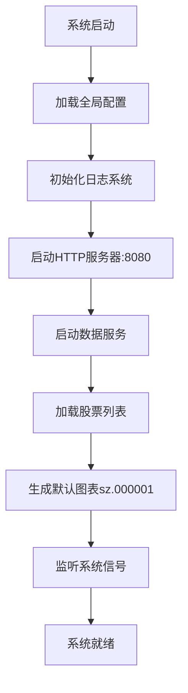
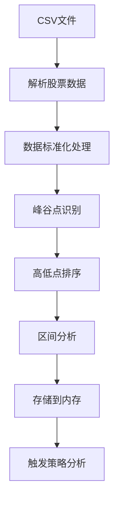
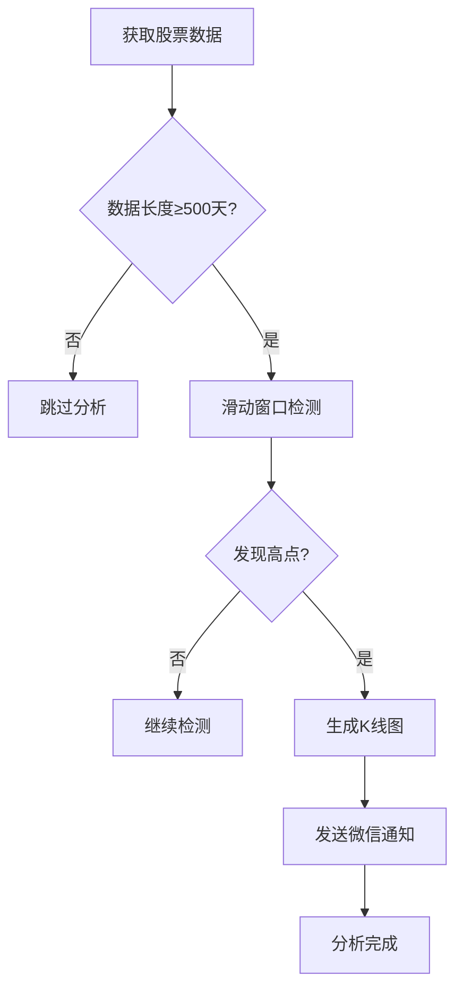
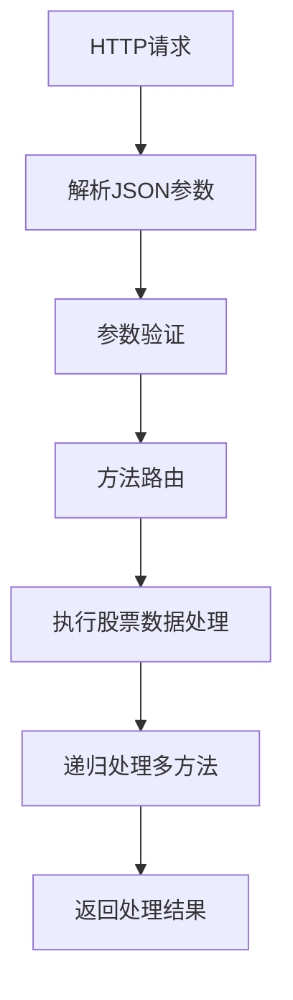

# Stock-Go 项目详细设计文档

## 项目概览

**Stock-Go** 是一个基于Go语言开发的股票数据分析和可视化系统，专注于提供技术分析工具和图表可视化功能。系统采用模块化架构设计，集成了数据处理、图表渲染、策略分析和Web服务等核心功能。

## 系统架构

### 整体架构图

```
┌─────────────────────────────────────────────────────────────────┐
│                         Stock-Go 系统架构                        │
├─────────────────────────────────────────────────────────────────┤
│                                                                 │
│  ┌──────────────┐    ┌──────────────┐    ┌──────────────┐      │
│  │    HTTP      │    │   数据处理    │    │   策略分析    │      │
│  │   服务层      │◄──►│    引擎       │◄──►│    系统       │      │
│  │ (8080端口)    │    │  (CSV数据)    │    │ (高点策略)    │      │
│  └──────────────┘    └──────────────┘    └──────────────┘      │
│         │                    │                   │             │
│         ▼                    ▼                   ▼             │
│  ┌──────────────┐    ┌──────────────┐    ┌──────────────┐      │
│  │   微信推送    │    │   数据存储    │    │   图表渲染    │      │
│  │   通知系统    │    │   (内存)     │    │ (多种引擎)    │      │
│  └──────────────┘    └──────────────┘    └──────────────┘      │
│                                                                 │
└─────────────────────────────────────────────────────────────────┘
```

### 技术栈

**核心技术**
- **编程语言**: Go 1.22.9
- **HTTP框架**: Go标准库 net/http
- **并发模型**: Goroutine + Channel

**图表可视化**
- **go-echarts/v2** v2.2.4 - 交互式Web图表
- **go-chart/v2** v2.1.0 - 静态图表生成  
- **go-gnuplot** - GNU Plot科学绘图
- **gonum.org/v1/plot** v0.14.0 - 科学计算图表
- **vicanso/go-charts/v2** v2.6.10 - 轻量级图表

## 核心模块设计

### 1. 应用入口 (stockServer.go:23)

**主要功能**:
- 系统初始化和启动协调
- 信号处理和优雅关闭
- 多服务并发启动

**启动流程**:
```go
func main() {
    defer logger.Close()          // 确保日志关闭
    go http.StartServer()         // 启动HTTP服务
    go stockData.Start()          // 启动数据服务  
    painter.PaintStockKline("sz.000001")  // 生成默认图表
    initSignal()                  // 信号处理
}
```

### 2. 全局配置模块 (globalConfig)

**配置常量**:
- `STOCK_SESSION_LEN = 500` - 股票分析会话长度
- `STOCK_SESSION_HIGHTPOINT_LEN = 15` - 高点策略时间窗口

**跨平台路径管理**:
```go
// macOS环境
DATA_PATH = "/Users/beven/Item/stockData/"
LOG_PATH = "/Users/beven/Item/stock-go/Log/"

// Linux环境  
DATA_PATH = "/home/beven/gits/stockData/"

// Windows环境
DATA_PATH = "D:\\Data\\"
LOG_PATH = "D:\\Log\\"
```

### 3. HTTP服务模块 (http)

**API端点**:

| 端点 | 方法 | 功能 | 参数结构 |
|------|------|------|----------|
| `/stock` | POST | 股票数据处理 | `stockParam` |
| `/readDayDate` | POST | 读取日期数据 | `readParam` |

**stockParam结构** (http/stockHandler.go:12):
```go
type stockParam struct {
    Code       string   `json:"code"`       // 股票代码
    IsReLoad   bool     `json:"isReLoad"`   // 是否重新加载
    IsReadFast bool     `json:"isReadFast"` // 快速读取
    CmdCount   int      `json:"cmdCount"`   // 命令计数
    IsPlot     bool     `json:"IsPlot"`     // 是否绘图
    Methods    []string `json:"Methods"`    // 执行方法列表
}
```

**支持的方法**:
- `"Sock.ReadDayData"` - 加载股票日数据
- `"Sock.AnalyzePaintSections"` - 分析绘制区间

### 4. 数据模型 (stockData)

**核心数据结构**:

```go
// 股票信息 (stockData/stockData.go:9)
type StockInfo struct {
    Code  string     // 股票代码
    Name  string     // 股票名称  
    Datas StockData  // 股票数据
}

// 股票数据集合 (stockData/stockData.go:17)
type StockData struct {
    DayDatas          StockDataDayList  // 日线数据
    Points            StockDataDayList  // 峰谷点
    Sections          StockDataDayList  // 区间数据
    HighPoints        StockDataDayList  // 高点数据
    LowPoints         StockDataDayList  // 低点数据
    SessionHighPoints StockDataDayList  // 会话高点
}

// 单日数据 (stockData/stockData.go:26)
type StockDataDay struct {
    Index      int     // 索引
    DataStr    string  // 日期字符串
    PointType  int     // 点类型 (峰/谷/普通)
    Trend      int     // 趋势方向
    PriceA     float32 // 平均价格
    PriceBegin float32 // 开盘价
    PriceEnd   float32 // 收盘价
    PriceHigh  float32 // 最高价
    PriceLow   float32 // 最低价
    PriceShow  float32 // 显示价格
}
```

**点类型常量** (stockData/defindStock.go:3):
```go
const (
    POINT_NORMAL int = 0  // 普通点
    POINT_PEAK   int = 1  // 峰值点
    POINT_BOTTOM int = 2  // 谷底点
)
```

### 5. 数据处理引擎 (stockData)

**数据加载流程** (stockData/loadData.go:62):

1. **股票列表加载** - 从CSV文件加载股票代码和名称
2. **CSV数据解析** - 解析股票历史价格数据
3. **数据标准化** - 处理除权除息，计算复权价格
4. **内存存储** - 数据存储在全局映射表中

**峰谷点识别算法** (stockData/dealStockData.go:30):

```go
func (stock *StockInfo) DealStockPoints() {
    // 逐日比较价格趋势
    for index, dayData := range stock.Datas.DayDatas {
        if dayDataToday.PriceA > dayDataYes.PriceA {
            dayDataToday.PointType = POINT_PEAK    // 标记为峰值
        } else {
            dayDataToday.PointType = POINT_BOTTOM  // 标记为谷底
        }
        
        // 过滤连续相同类型的点
        if dayDataToday.PointType == dayDataYes.PointType {
            dayDataYes.PointType = POINT_NORMAL
        }
    }
    
    // 按价格排序高低点
    sort.Slice(stock.Datas.HighPoints, func(i, j int) bool {
        return stock.Datas.HighPoints[i].PriceA > stock.Datas.HighPoints[j].PriceA
    })
}
```

### 6. 策略分析系统 (stockStrategy)

**高点策略算法** (stockStrategy/hightPointStrategy.go:10):

核心逻辑：
1. 检查股票数据长度是否满足分析条件（≥500天）
2. 遍历历史高点，筛选15天内的关键高点
3. 验证高点价格是否高于500天前的价格
4. 触发条件时生成K线图并发送通知

**循环峰值检测算法** (stockStrategy/hightPointStrategy.go:52):

使用**单调递减队列**优化的滑动窗口最大值算法：

```go
func HighPointStrategyDayByDay(stockCode string) {
    queue := make([]int, 0)  // 单调递减队列
    
    // 建立初始队列（前500天）
    for i := 0; i < globalConfig.STOCK_SESSION_LEN; i++ {
        // 维护单调递减性质
        for len(queue) > 0 && 
            stock.Datas.DayDatas[queue[len(queue)-1]].PriceA < 
            stock.Datas.DayDatas[i].PriceA {
            queue = queue[:len(queue)-1]
        }
        queue = append(queue, i)
    }
    
    // 滑动窗口检测
    for i := globalConfig.STOCK_SESSION_LEN; i < stockSessionLen; i++ {
        // 移除超出窗口的元素
        for len(queue) > 0 && queue[0] <= i-globalConfig.STOCK_SESSION_LEN {
            queue = queue[1:]
        }
        
        // 维护单调递减性质
        // ... 
        
        // 检测当前点是否为区间最大值
        if len(queue) > 0 && queue[0] == i {
            // 触发高点策略
            painter.PaintStockKline(stockCode)
            break
        }
    }
}
```

**算法优势**：
- **时间复杂度**: O(n) - 每个元素最多入队出队一次
- **空间复杂度**: O(k) - k为窗口大小
- **实时性**: 支持流式数据处理

### 7. 图表渲染引擎 (painter)

**支持的图表类型**:

1. **K线图** (painter/line.go:182)
   - 蜡烛图显示OHLC数据
   - 支持缩放和平移交互
   - 高低点标记
   - 区间分析可视化

2. **折线图** (painter/line.go:15)
   - 价格趋势线
   - 峰谷点散点图叠加
   - 多数据系列支持

**关键特性**:
```go
// 缩放控件配置
charts.WithDataZoomOpts(opts.DataZoom{
    Type:       "slider",    // 滑块缩放
    Start:      50,          // 起始位置50%
    End:        100,         // 结束位置100%
    XAxisIndex: []int{0},    // X轴索引
})

// 内部缩放支持
charts.WithDataZoomOpts(opts.DataZoom{
    Type:       "inside",    // 鼠标缩放
    Start:      50,
    End:        100,
    XAxisIndex: []int{0},
})
```

### 8. 微信通知系统 (utils/wechat.go)

**功能特性**:
- 企业微信API集成
- Token自动获取和管理
- 消息推送到指定用户/部门
- 分析结果实时通知

**API接口**:
```go
// 获取访问令牌 (utils/wechat.go:45)
func GetToken() (tokenRes string)

// 发送微信消息 (utils/wechat.go:78)  
func SendWeChatMessage(message string)
```

### 9. 定时任务系统 (utils/utils.go)

**工作日检测和定时执行**:
```go
// 每天定时执行任务 (utils/utils.go:18)
func DoWorkEveryDayOnce(f func(), executeTime *string) bool
```

**特性**:
- 工作日自动检测
- 指定时间执行（默认19:00）
- 防重复执行机制
- 5分钟间隔检查

## 业务流程

### 1. 系统启动流程



### 2. 数据处理流程



### 3. 策略分析流程



### 4. API请求处理流程



## 关键算法

### 1. 单调递减队列滑动窗口最大值

**应用场景**: 高效检测价格区间最大值

**算法特点**:
- 维护队列头部为当前窗口最大值
- 队列元素按价格单调递减排列
- 时间复杂度O(n)，空间复杂度O(k)

### 2. 峰谷点识别算法

**核心思想**: 
- 基于相邻日价格比较
- 过滤连续相同类型点
- 按价格排序便于后续分析

### 3. 复权价格计算

**处理逻辑**:
```go
// 检测除权除息事件 (stockData/loadData.go:89)
if priceEndY != 0 && (priceBegin/priceEndY < 0.85) {
    Interest = Interest / priceBegin * priceEndY  // 调整复权系数
}

// 应用复权系数
stock.PriceBegin = float32(priceBegin * Interest)
stock.PriceEnd = float32(priceEnd * Interest)
```

## 性能优化

### 1. 内存管理
- 数据存储在全局映射表，避免重复加载
- 使用切片预分配减少内存重分配
- 延迟加载策略，按需加载股票数据

### 2. 并发处理
- HTTP服务和数据处理服务并发启动
- 使用Goroutine处理独立任务
- Channel实现安全的数据传递

### 3. 算法优化
- 单调队列优化滑动窗口计算
- 数据排序一次性完成，避免重复排序
- 缓存计算结果减少重复计算

## 部署和运维

### 1. 环境要求
- Go 1.22.9+
- 操作系统: Linux/macOS/Windows
- 内存: 4GB+ (处理大规模股票数据)

### 2. 启动方式
```bash
# 直接运行
go run stockServer.go

# 编译后运行
go build -o stockServer .
./stockServer
```

### 3. 配置管理
- 跨平台路径自动配置
- 环境变量支持配置覆盖
- 日志级别可调节

### 4. 监控和日志
- 结构化日志输出
- 性能计时统计
- 错误日志记录
- 微信消息推送监控

## 扩展性设计

### 1. 模块化架构
- 清晰的模块职责分离
- 标准化的接口设计
- 低耦合高内聚

### 2. 数据源扩展
- 支持多种数据格式
- 可扩展不同数据源
- 标准化数据结构

### 3. 策略算法扩展
- 插件式策略注册
- 标准化策略接口
- 配置化策略参数

### 4. 图表类型扩展
- 多图表引擎支持
- 可配置图表样式
- 交互功能增强

## 项目目录结构

```
stock-go/
├── Data/                    # 数据文件目录
│   ├── stockList.csv        # 股票列表
│   └── *.csv               # 股票历史数据文件
├── globalConfig/            # 全局配置
│   └── globalConfig.go     # 系统配置管理
├── http/                    # HTTP服务
│   ├── server.go           # HTTP服务器
│   ├── stockHandler.go     # 股票处理器
│   └── readDayDate.go      # 读取日期数据
├── logger/                  # 日志模块
│   └── logger.go           # 日志管理
├── painter/                 # 绘图模块
│   └── line.go             # 图表绘制
├── stockData/              # 股票数据处理
│   ├── stockData.go        # 数据结构定义
│   ├── loadData.go         # 数据加载
│   ├── dealStockData.go    # 数据处理算法
│   └── defindStock.go      # 常量定义
├── stockStrategy/          # 策略模块
│   └── hightPointStrategy.go # 高点策略算法
├── utils/                  # 工具模块
│   ├── utils.go           # 通用工具
│   └── wechat.go          # 微信功能
├── go.mod                  # Go模块文件
├── go.sum                  # 依赖校验文件
├── stockServer.go          # 主程序入口
└── 详细设计.md              # 本设计文档
```

## 核心配置参数

### 全局常量配置

| 参数名 | 值 | 说明 |
|--------|-----|------|
| `STOCK_SESSION_LEN` | 500 | 股票分析会话长度（天数） |
| `STOCK_SESSION_HIGHTPOINT_LEN` | 15 | 高点策略时间窗口（天数） |
| `STOCK_DATA_LOAD_PCT` | 500 | 数据加载比例参数 |
| `STOCK_DATA_LOAD_MOD` | 0 | 数据加载模数参数 |

### 路径配置

系统根据运行环境自动配置数据和日志路径：

**macOS环境**:
- 数据路径: `/Users/beven/Item/stockData/`
- 日志路径: `/Users/beven/Item/stock-go/Log/`

**Linux环境**:
- 数据路径: `/home/beven/gits/stockData/`
- 日志路径: `../Log/`

**Windows环境**:
- 数据路径: `D:\Data\`
- 日志路径: `D:\Log\`

## 安全性考虑

### 1. 数据安全
- CSV文件读取权限控制
- 内存数据访问保护
- 错误处理防止程序崩溃

### 2. API安全
- 输入参数验证
- JSON解析异常处理
- HTTP请求大小限制

### 3. 微信集成安全
- Token安全存储和更新
- API调用频率控制
- 敏感信息脱敏处理

## 监控指标

### 1. 性能指标
- 数据加载耗时统计
- 内存使用情况监控
- HTTP请求响应时间

### 2. 业务指标
- 股票数据更新频率
- 策略触发次数统计
- 图表生成成功率

### 3. 系统指标
- 服务可用性监控
- 日志文件大小控制
- 异常错误率统计

---

Stock-Go项目通过模块化设计和优化的算法实现，为股票数据分析提供了高效、可扩展的技术解决方案。系统具备良好的性能表现和扩展能力，适合用于专业的股票技术分析场景。